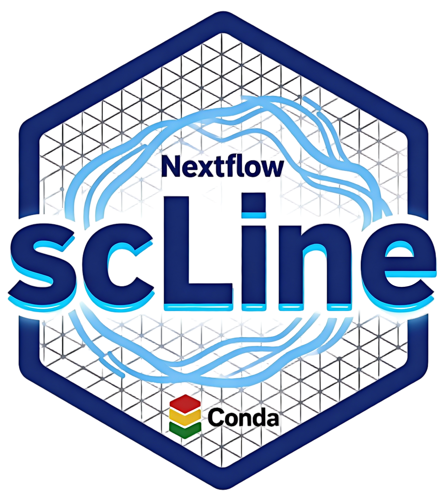
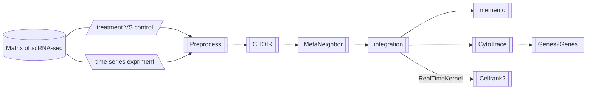

<br>
<a href ="https://github.com/ydgenomics/scLine"></a>

<!-- badges: start -->
<!-- badges: end -->

**scLine**(**s**ingle-**c**ell analysis pipe**line**)是一个基于 nextflow 搭建的一个端到端、用户使用友好(Friendly)、可重复(Repeatable)、兼顾通用性(Universal)和灵活性(Flexible)的单细胞分析流程软件。涵盖数据质控、自动化注释、数据整合去批次、差异分析、富集分析、数据格式转换和伪时序分析，支持一行代码跑整个流程，也支持按子流程需求运行，极大利用了 nextflow 高效的资源监管优势。

<br>


## Installation

基于[Git](https://git-scm.com/install/linux)和[Conda](https://www.anaconda.com/docs/getting-started/miniconda/install)配置环境

1. **复制scLine代码仓库**
   ```shell
   git clone https://github.com/ydgenomics/scLine.git
   cd scLine
   # 如果已经安装了nextflow，运行下面代码测试
   # nextflow run main.nf --help
   ```
2. **配置Conda环境** [README](./env/README.md)
   - 方案一: 基于软件下载命令分布运行配置环境 [convert](./env/convert_env.sh) [scib](./env/scib_env.sh) [scline](./env/scline_env.sh)
   - 方案二: 基于`.yaml`文件使用`conda env create -f *.yaml`构建对应环境，但有些包并不是基于conda安装，仍然存在挑战 [*.yaml](./env)
3. **配置`nextflow.config`的Conda环境**
   ！！！修改其85-99行的环境代码，替代为自己机器真实Conda环境的绝对地址和可用环境名
   ```shell
   // --- scline: ---
   def sclineEnv = '''
       source /opt/software/miniconda3/bin/activate
       conda activate scline
   '''
   // --- convert: ---
   def convertEnv = '''
       source /opt/software/miniconda3/bin/activate
       conda activate convert
   '''
   // --- scib: ---
   def scibEnv = '''
       source /opt/software/miniconda3/bin/activate
       conda activate scib
   '''
   ```

## Vignettes



### 子流程运行

|No.|subPipeline|mode|Details|Software|
|-|-|-|-|-|
|01|QC|qc|质控|[SoupX](https://github.com/constantAmateur/SoupX); [scrublet](https://github.com/swolock/scrublet)|
|02|CLUSTER|cluster|最优分群|[CHOIR](https://github.com/corceslab/CHOIR)|
|03|INTEGRATE|integrate|分组数据整合去批次|[harmony](https://github.com/immunogenomics/harmony); [scvi-tools](https://github.com/scverse/scvi-tools); [LIGER](https://github.com/welch-lab/liger); [CCA](https://crazyhottommy.github.io/single-cell-RNAseq-PCA-CCA-cell-annotation/how-seurat-cca-label-transfer.html); [scib-metrics](https://github.com/YosefLab/scib-metrics)|
|04|METANEIGHBOR|metaneighbor|群相似性|[MetaNeighbor](https://github.com/maggiecrow/MetaNeighbor)|
|05|DEA|dea|差异分析|[memento](https://github.com/yelabucsf/scrna-parameter-estimation)|
|07|PSEUDOTIME|pseudotime|伪时序|[CytoTrace](https://cytotrace.stanford.edu/); [cellrank2](https://cellrank.readthedocs.io/en/latest/about/version2.html); [Genes2Genes](https://github.com/Teichlab/Genes2Genes)|

- **运行**
  ```shell
  nextflow run main.nf --mode all \
  --rawPaths '/data/work/scline/input/sample1_raw_seed11_p10|/data/work/scline/input/sample1_raw_seed12_p10' \
  --filterPaths '/data/work/scline/input/sample1_filter_seed11_p10|/data/work/scline/input/sample1_filter_seed12_p10' \
  --biosampleValues 'group1|group1' \
  --sampleValues 'sample1|sample2' \
  --python_env '/opt/software/miniconda3/envs/scline/bin/python' \
  --rdsORcsv '/data/work/scline/input/markergene.csv' \
  --cluster_key 'leiden_res_0.50' \
  --prefix 'example1' \
  --other1_key 'biosample' \
  --other2_key 'anno' \
  --ident_1 'celltype2' --ident_2 'celltype3' \
  --cluster_value 'celltype2' \
  --outdir './output/example1' \
  --runsoupx 'yes' \
  --runsct 'yes' \
  --emapper_xlsx '/data/work/scline/input/eggNOG_annotation.xlsx' \
  --rlst '0.5'
  ```
- **输出**
  - 每个子分析单独生成一个文件夹，包含单细胞数据和可视化文件
  - 输出运行记录`*.log`，任务运行时间和资源使用见`execution-report.html`和`execution-timeline.html`
- **报错**: 每个子任务运行前检查必须输入文件是否完整，若问题输出报错和缺失信息
- **帮助**: 通过`nextflow run main.nf --help`输出帮助信息(参数解释，输出示例)


## Reference
|Software|Year|Article|
|-|-|-|
|**scDown**|2025|Sun, L., Ma, Q., Cai, C., Labaf, M., Jain, A., Dias, C., Rockowitz, S., & Sliz, P. (2025). scDown: A Pipeline for Single-Cell RNA-Seq Downstream Analysis. International journal of molecular sciences, 26(11), 5297. https://doi.org/10.3390/ijms26115297|
|SCMeTA|2024|Pan, X., Pan, S., Du, M., Yang, J., Yao, H., Zhang, X., & Zhang, S. (2024). SCMeTA: a pipeline for single-cell metabolic analysis data processing. Bioinformatics (Oxford, England), 40(9), btae545. https://doi.org/10.1093/bioinformatics/btae545|
|Panpipes|2024|Curion, F., Rich-Griffin, C., Agarwal, D., Ouologuem, S., Rue-Albrecht, K., May, L., Garcia, G. E. L., Heumos, L., Thomas, T., Lason, W., Sims, D., Theis, F. J., & Dendrou, C. A. (2024). Panpipes: a pipeline for multiomic single-cell and spatial transcriptomic data analysis. Genome biology, 25(1), 181. https://doi.org/10.1186/s13059-024-03322-7|
|MultiSC|2024|Lin, X., Jiang, S., Gao, L., Wei, Z., & Wang, J. (2024). MultiSC: a deep learning pipeline for analyzing multiomics single-cell data. Briefings in bioinformatics, 25(6), bbae492. https://doi.org/10.1093/bib/bbae492|
||2023|Heumos, L., Schaar, A. C., Lance, C., Litinetskaya, A., Drost, F., Zappia, L., Lücken, M. D., Strobl, D. C., Henao, J., Curion, F., Single-cell Best Practices Consortium, Schiller, H. B., & Theis, F. J. (2023). Best practices for single-cell analysis across modalities. Nature reviews. Genetics, 24(8), 550–572. https://doi.org/10.1038/s41576-023-00586-w|
|**single-cell-best-practice**|2023-|https://www.sc-best-practices.org/|
|IBRAP|2023|Knight, C. H., Khan, F., Patel, A., Gill, U. S., Okosun, J., & Wang, J. (2023). IBRAP: integrated benchmarking single-cell RNA-sequencing analytical pipeline. Briefings in bioinformatics, 24(2), bbad061. https://doi.org/10.1093/bib/bbad061|
|**SCP**|2023|https://github.com/zhanghao-njmu/SCP|
||2022|Bertolini, A., Prummer, M., Tuncel, M. A., Menzel, U., Rosano-González, M. L., Kuipers, J., Stekhoven, D. J., Tumor Profiler consortium, Beerenwinkel, N., & Singer, F. (2022). scAmpi-A versatile pipeline for single-cell RNA-seq analysis from basics to clinics. PLoS computational biology, 18(6), e1010097. https://doi.org/10.1371/journal.pcbi.1010097|
||2021|Shaw, R., Tian, X., & Xu, J. (2021). Single-Cell Transcriptome Analysis in Plants: Advances and Challenges. Molecular plant, 14(1), 115–126. https://doi.org/10.1016/j.molp.2020.10.012|
||2020|Ding, J., Adiconis, X., Simmons, S. K., Kowalczyk, M. S., Hession, C. C., Marjanovic, N. D., Hughes, T. K., Wadsworth, M. H., Burks, T., Nguyen, L. T., Kwon, J. Y. H., Barak, B., Ge, W., Kedaigle, A. J., Carroll, S., Li, S., Hacohen, N., Rozenblatt-Rosen, O., Shalek, A. K., Villani, A. C., … Levin, J. Z. (2020). Systematic comparison of single-cell and single-nucleus RNA-sequencing methods. Nature biotechnology, 38(6), 737–746. https://doi.org/10.1038/s41587-020-0465-8|
|**scTyper**|2020|Choi, J. H., In Kim, H., & Woo, H. G. (2020). scTyper: a comprehensive pipeline for the cell typing analysis of single-cell RNA-seq data. BMC bioinformatics, 21(1), 342. https://doi.org/10.1186/s12859-020-03700-5.|
|**SINCERA**|2015|Guo, M., Wang, H., Potter, S. S., Whitsett, J. A., & Xu, Y. (2015). SINCERA: A Pipeline for Single-Cell RNA-Seq Profiling Analysis. PLoS computational biology, 11(11), e1004575. https://doi.org/10.1371/journal.pcbi.1004575|