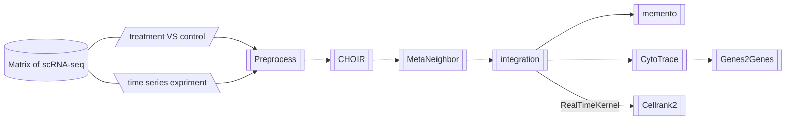

<br>
<a href ="https://github.com/ydgenomics/scLine"></a>

<!-- badges: start -->
<!-- badges: end -->

**scLine**(**s**ingle-**c**ell analysis pipe**line**)是一个基于 nextflow 搭建的一个端到端、用户使用友好(Friendly)、可重复(Repeatable)、兼顾通用性(Universal)和灵活性(Flexible)的单细胞分析流程软件。涵盖数据质控、自动化注释、数据整合去批次、差异分析、富集分析、数据格式转换和伪时序分析，支持一行代码跑整个流程，也支持按子流程需求运行，极大利用了 nextflow 高效的资源监管优势。

<br>


## Installation

基于[Git](https://git-scm.com/install/linux)和[Conda](https://www.anaconda.com/docs/getting-started/miniconda/install)配置环境

1. **复制scLine代码仓库**
   ```shell
   git clone https://github.com/ydgenomics/scLine.git
   cd scLine
   # 如果已经安装了nextflow，运行下面代码测试
   # nextflow run main.nf --help
   ```
2. **配置Conda环境** [README](./env/README.md)
   - 方案一: 基于软件下载命令分布运行配置环境 [convert](./env/convert_env.sh) [scib](./env/scib_env.sh) [scline](./env/scline_env.sh)
   - 方案二: 基于`.yaml`文件使用`conda env create -f *.yaml`构建对应环境，但有些包并不是基于conda安装，仍然存在挑战 [*.yaml](./env)
3. **配置`nextflow.config`的Conda环境**
   ！！！修改其85-99行的环境代码，替代为自己机器真实Conda环境的绝对地址和可用环境名
   ```shell
   // --- scline: ---
   def sclineEnv = '''
       source /opt/software/miniconda3/bin/activate
       conda activate scline
   '''
   // --- convert: ---
   def convertEnv = '''
       source /opt/software/miniconda3/bin/activate
       conda activate convert
   '''
   // --- scib: ---
   def scibEnv = '''
       source /opt/software/miniconda3/bin/activate
       conda activate scib
   '''
   ```

## Vignettes


对矩阵数据传入使用`.csv`
```
rawPaths,filterPaths,biosampleValues,sampleValues
/data/work/scline/input/sample1/sample1_raw,/data/work/scline/input/sample1/sample1_filter,group1,sample1
/data/work/scline/input/sample2/sample2_raw,/data/work/scline/input/sample2/sample2_filter,group2,sample2
```
> 注意：测试数据不包含rawmatrix，在写main.nf时要添加判断兼容这种情况


### CHOIR
```shell
Rscript choir.R --input_rds "input.rds"
```

### DEA: memento
```shell
sh ./bin/05_dea/dea.sh
```

### CytoTrace
`./bin/07_pseudotime/CytoTRACE.py`

### Genes2Genes
将CytoTrace的结果作为输入，需要考虑到同一标签不同分组数据那个作为query，那个作为reference。`./bin/07/pseudotime/genes2genes.py`还没做外部传参处理
