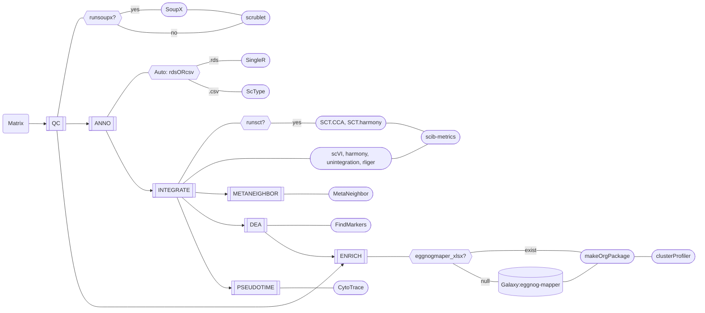

<br>
<a href ="https://github.com/ydgenomics/scLine"></a>

<!-- badges: start -->
<!-- badges: end -->

**scLine**(**s**ingle-**c**ell analysis pipe**line**)是一个基于 nextflow 搭建的一个端到端、用户使用友好(Friendly)、可重复(Repeatable)、兼顾通用性(Universal)和灵活性(Flexible)的单细胞分析流程软件。涵盖数据质控、自动化注释、数据整合去批次、差异分析、富集分析、数据格式转换和伪时序分析，支持一行代码跑整个流程，也支持按子流程需求运行，极大利用了 nextflow 高效的资源监管优势。

<br>


## Installation

基于[Git](https://git-scm.com/install/linux)和[Conda](https://www.anaconda.com/docs/getting-started/miniconda/install)配置环境

1. **复制scLine代码仓库**
   ```shell
   git clone https://github.com/ydgenomics/scLine.git
   cd scLine
   # 如果已经安装了nextflow，运行下面代码测试
   # nextflow run main.nf --help
   ```
2. **配置Conda环境** [README](./env/README.md)
   - 方案一: 基于软件下载命令分布运行配置环境 [convert](./env/convert_env.sh) [scib](./env/scib_env.sh) [scline](./env/scline_env.sh)
   - 方案二: 基于`.yaml`文件使用`conda env create -f *.yaml`构建对应环境，但有些包并不是基于conda安装，仍然存在挑战 [*.yaml](./env)
3. **配置`nextflow.config`的Conda环境**
   ！！！修改其85-99行的环境代码，替代为自己机器真实Conda环境的绝对地址和可用环境名
   ```shell
   // --- scline: ---
   def sclineEnv = '''
       source /opt/software/miniconda3/bin/activate
       conda activate scline
   '''
   // --- convert: ---
   def convertEnv = '''
       source /opt/software/miniconda3/bin/activate
       conda activate convert
   '''
   // --- scib: ---
   def scibEnv = '''
       source /opt/software/miniconda3/bin/activate
       conda activate scib
   '''
   ```

## Vignettes
scLine通过`--mode`参数来区分运行子流程和全流程，子流程文件输入各有要求，详见不同`mode`的帮助信息
```shell
$ nextflow run main.nf --help

 N E X T F L O W   ~  version 25.04.6

Launching `main.nf` [suspicious_mestorf] DSL2 - revision: 63ac5fd7de


    ================================================================================
    scline: single-cell analysis pipeline
    ================================================================================
    
    Usage:
    nextflow run main.nf --mode <MODE> [OPTIONS]
    
    Available Modes:
    - qc          : Quality control and preprocessing
    - convert     : Data format conversion
    - anno        : Cell type annotation
    - integrate   : Data integration and batch correction
    - metaneighbor: MetaNeighbor analysis
    - dea         : Differential expression analysis
    - enrich      : Functional enrichment analysis
    - pseudotime  : Pseudotime trajectory analysis
    
    For mode-specific help:
    nextflow run main.nf --mode <MODE> --help
    
    ================================================================================
```



### 子流程运行

|No.|subPipeline|mode|Details|Software|
|-|-|-|-|-|
|01|QC|qc|质控|[SoupX](https://github.com/constantAmateur/SoupX); [scrublet](https://github.com/swolock/scrublet)|
|02|ANNO|anno|样本细胞注释|[SingleR](https://github.com/dviraran/SingleR); [ScType](https://github.com/IanevskiAleksandr/sc-type)|
|03|INTEGRATE|integrate|分组数据整合去批次|[harmony](https://github.com/immunogenomics/harmony); [scvi-tools](https://github.com/scverse/scvi-tools); [LIGER](https://github.com/welch-lab/liger); [CCA](https://crazyhottommy.github.io/single-cell-RNAseq-PCA-CCA-cell-annotation/how-seurat-cca-label-transfer.html); [scib-metrics](https://github.com/YosefLab/scib-metrics)|
|04|METANEIGHBOR|metaneighbor|群相似性|[MetaNeighbor](https://github.com/maggiecrow/MetaNeighbor)|
|05|DEA|dea|差异分析|[FindMarkers](https://satijalab.org/seurat/reference/findmarkers)|
|06|ENRICH|enrich|富集分析|[Galaxy(website)](https://usegalaxy.eu/):eggnog-mapper; [clusterProfiler](https://github.com/YuLab-SMU/clusterProfiler)|
|07|PSEUDOTIME|pseudotime|伪时序|[CytoTrace](https://cytotrace.stanford.edu/); [cellrank2](https://cellrank.readthedocs.io/en/latest/about/version2.html)|

<details> <summary> <strong> qc </strong> </summary>

```shell
$ nextflow run main.nf --mode qc --help

 N E X T F L O W   ~  version 25.04.6

Launching `main.nf` [adoring_sinoussi] DSL2 - revision: 63ac5fd7de


    ================================================================================
    QC Mode - Quality Control and Preprocessing
    ================================================================================
    
    Usage:
    nextflow run main.nf --mode qc [OPTIONS]
    
    Required Parameters:
    --rawPaths str                Pipe-separated list of raw data paths
    --filterPaths str             Pipe-separated list of filtered data paths
    --biosampleValues str         Pipe-separated biosample group names
    --sampleValues str            Pipe-separated sample names
    
    Optional Parameters:
    --tfidfMin int/float          Minimum value of tfidf to accept for a marker gene (SoupX)
                                  Default: 1 (If SoupX is not working properly, try decreasing it.)
    --rlst str                    Pipe-separated list of rlst values for SoupX
                                  Default: "0.2|0.5|0.8|1.0"
    --runsoupx str                Run SoupX contamination removal? 'yes' or 'no'
                                  Default: 'no'
    --outdir str                  Output directory path
                                  Default: './results'
    --qc_cpu str                  CPU resource [SOUPX|SCRUBLET]
                                  Default: '2|1'                      
    --qc_mem str                  Memory resource (GB) [SOUPX|SCRUBLET]
                                  Default: '4|2'
                                  
    Example:
    nextflow run main.nf --mode qc \
        --rawPaths '/data/work/scline/input/sample1/sample1_raw|/data/work/scline/input/sample2/sample2_raw' \
        --filterPaths '/data/work/scline/input/sample1/sample1_filter|/data/work/scline/input/sample2/sample2_filter' \
        --biosampleValues 'group1|group2' \
        --sampleValues 'sample1|sample2' \
        --runsoupx 'yes' \
        --outdir './results/qc'
```

</details>


<details> <summary> <strong> convert </strong> </summary>

```shell
$ nextflow run main.nf --mode convert --help

 N E X T F L O W   ~  version 25.04.6

Launching `main.nf` [crazy_poitras] DSL2 - revision: 63ac5fd7de


    ================================================================================
    Convert Mode - Data Format Conversion
    ================================================================================
    
    Usage:
    nextflow run main.nf --mode convert [OPTIONS]
    
    Required Parameters:
    --inputFile str               Input file path for conversion
    --assay str                   Assay type will be converted
    --python_env str              Python environment to use
    
    Optional Parameters:
    --outdir str                  Output directory path
                                  Default: './results'
    --convert_cpu int             CPU resource
                                  Default: 1                    
    --convert_mem int             Memory resource (GB)
                                  Default: 2
                                  
    Example:
    nextflow run main.nf --mode convert \
        --inputFile '/data/work/scline/results/qc/qc/group1/group1.h5ad' \
        --assay 'RNA' \
        --python_env '/opt/software/miniconda3/envs/scline/bin/python' \
        --outdir './results/convert'
```

</details>


<details> <summary> <strong> anno </strong> </summary>

```shell
$ nextflow run main.nf --mode anno --help

 N E X T F L O W   ~  version 25.04.6

Launching `main.nf` [stupefied_visvesvaraya] DSL2 - revision: 63ac5fd7de


    ================================================================================
    Annotation Mode - Cell Type Annotation
    ================================================================================
    
    Usage:
    nextflow run main.nf --mode anno [OPTIONS]
    
    Required Parameters:
    --input_query_rds str         Input query .rds file (unannotated)
    --rdsORcsv str                Annotation reference file for scType(.csv) or singleR(.rds)
    --cluster_key str             Cluster key in the data for annotation
    --umap_name str               UMAP name for plotting
                                  Default: 'Xumap_' (must exist in .obsm)
    --ref_cluster_key str         Reference cluster key in rdsORcsv(.rds)
                                  Default: 'celltype' (when run singleR is required!)
    
    Optional Parameters:
    --outdir str                  Output directory path
                                  Default: './results'
    --anno_cpu int                CPU resource
                                  Default: 1                    
    --anno_mem int                Memory resource (GB)
                                  Default: 2
    
    Example:
    nextflow run main.nf --mode anno \
        --input_query_rds '/data/work/scline/results/convert/group1.hr.rds' \
        --rdsORcsv '/data/work/scline/input/markergene.csv' \
        --cluster_key 'leiden_res_0.50' \
        --umap_name 'Xumap_' \
        --outdir './results/anno'
```

</details>

<details> <summary> <strong> integrate </strong> </summary>

```shell
$ nextflow run main.nf --mode integrate --help

 N E X T F L O W   ~  version 25.04.6

Launching `main.nf` [happy_leibniz] DSL2 - revision: 63ac5fd7de


    ================================================================================
    Integration Mode - Data Integration and Batch Correction
    ================================================================================
    
    Usage:
    nextflow run main.nf --mode integrate [OPTIONS]
    
    Required Parameters:
    --inputH5ad str               Pipe-separated list of input H5AD files
    --annoCsv str                 Annotation CSV file (two columns: 'barcode' & 'anno')
                                  (if not exist, could use the same input of '--inputH5ad')
    --biosampleValues str         Pipe-separated biosample names
    --prefix str                  Output prefix
    --other1_key str              Additional metadata key 1 (must exist in .obs.column)
                                  Default: 'biosample'
    --other2_key str              Additional metadata key 2 (must exist in .obs.column and best with annotation info)
                                  Default: 'leiden_res_0.50'
    --python_env str              Python environment to use                              
    
    Optional Parameters:
    --resolutionSet float         Resolution parameter for clustering after integration
                                  Default: 0.5
    --runsct str                  Run SCTransform(SCT.CCA and SCT.harmony)? 'yes' or 'no'
                                  Default: 'no' (Running it will spend many resource)
    --outdir str                  Output directory path
                                  Default: './results'
    --inte_cpu str                CPU resource [CONCAT|SCVI|HARMONY|UNINTEGRATION|CONVERT_1|RLIGER|CONVERT_1_int|SCT_CCA|SCT_HARMONY|CONVERT_2_int|DEALPLUS|SCIB]
                                  Default: '1|8|2|2|1|2|1|4|4|1|1|8'                    
    --inte_mem str                Memory resource (GB) [CONCAT|SCVI|HARMONY|UNINTEGRATION|CONVERT_1|RLIGER|CONVERT_1_int|SCT_CCA|SCT_HARMONY|CONVERT_2_int|DEALPLUS|SCIB]
                                  Default: '2|4|4|4|4|4|4|8|8|4|4|8'
                                  
    Example:
    nextflow run main.nf --mode integrate \
        --inputH5ad '/data/work/scline/results/qc/qc/group1/group1.h5ad|/data/work/scline/results/qc/qc/group2/group2.h5ad' \
        --annoCsv '/data/work/scline/results/qc/qc/group1/group1.h5ad|/data/work/scline/results/qc/qc/group2/group2.h5ad' \
        --biosampleValues 'group1|group2' \
        --prefix 'cotton' \
        --other1_key 'biosample' \
        --other2_key 'leiden_res_0.50' \
        --python_env '/opt/software/miniconda3/envs/scline/bin/python' \
        --runsct 'yes' \
        --outdir './results/integrate'
```

</details>

<details> <summary> <strong> metaneighbor </strong> </summary>

```shell
$ nextflow run main.nf --mode metaneighbor --help

 N E X T F L O W   ~  version 25.04.6

Launching `main.nf` [romantic_banach] DSL2 - revision: 63ac5fd7de


    ================================================================================
    MetaNeighbor Mode - Cell Type Similarity Analysis
    ================================================================================
    
    Usage:
    nextflow run main.nf --mode metaneighbor [OPTIONS]
    
    Required Parameters:
    --inputFile str               Input integrated RDS file
    --prefix str                  Output prefix
    --batch_key str               Batch key in metadata
    --cluster_key str             Cluster key in metadata
    --seq str                     Pipe-separated sequence identifiers (values of batch_key combined with '|')
    
    Optional Parameters:
    --slimit float                Similarity limit threshold
                                  Default: 0.8
    --outdir str                  Output directory path
                                  Default: './results'
    --meta_cpu int                CPU resource
                                  Default: 1                    
    --meta_mem int                Memory resource (GB)
                                  Default: 2
                                  
    Example:
    nextflow run main.nf --mode metaneighbor \
        --inputFile '/data/work/scline/results/integrate/cotton_rliger.INMF_integrated_dealplus.rds' \
        --prefix 'cotton' \
        --batch_key 'biosample' \
        --cluster_key 'leiden_res_0.50' \
        --seq 'group1|group2' \
        --outdir './results/metaneighbor'
```

</details>

<details> <summary> <strong> dea </strong> </summary>

```shell
$ nextflow run main.nf --mode dea --help

 N E X T F L O W   ~  version 25.04.6

Launching `main.nf` [evil_salas] DSL2 - revision: 63ac5fd7de


    ================================================================================
    DEA Mode - Differential Expression Analysis
    ================================================================================
    
    Usage:
    nextflow run main.nf --mode dea [OPTIONS]
    
    Required Parameters:
    --inputFile str               Input RDS file
    --cluster_key str             Cluster key in metadata
    --ident_1 str                 Identity 1 for comparison
    --ident_2 str                 Identity 2 for comparison
    
    Optional Parameters:
    --outdir str                  Output directory path
                                  Default: './results'
    --dea_cpu int                 CPU resource
                                  Default: 1                    
    --dea_mem int                 Memory resource (GB)
                                  Default: 2
                                  
    Example:
    nextflow run main.nf --mode dea \
        --inputFile '/data/work/scline/results/integrate/cotton_rliger.INMF_integrated_dealplus.rds' \
        --cluster_key 'leiden_res_0.50' --ident_1 '0' --ident_2 '1' \
        --outdir './results/dea'
```

</details>

<details> <summary> <strong> enrich </strong> </summary>

```shell
$ nextflow run main.nf --mode enrich --help

 N E X T F L O W   ~  version 25.04.6

Launching `main.nf` [peaceful_rosalind] DSL2 - revision: 63ac5fd7de


    ================================================================================
    ENRICH Mode - Functional Enrichment Analysis
    ================================================================================
    
    Usage:
    nextflow run main.nf --mode enrich [OPTIONS]
    
    Required Parameters:
    --emapper_xlsx str            EggNOG mapper annotations file
    --gene_csv str                Gene markers CSV file included these columns (cluster/gene/) 
    
    Optional Parameters:
    --genus str                   Genus name
                                  Default: "Genus"
    --species str                 Species name
                                  Default: "species"
    --minp float                  Minimum p-value threshold
                                  Default: 0.05
    --outdir str                  Output directory path
                                  Default: './results'
    --enrich_cpu int              CPU resource
                                  Default: 1                    
    --enrich_mem int              Memory resource (GB)
                                  Default: 2
                                  
    Example:
    nextflow run main.nf --mode enrich \
        --emapper_xlsx '/data/work/scline/bin/06_enrich/out.emapper.annotations.xlsx' \
        --gene_csv '/data/work/scline/bin/06_enrich/leiden_res_0.50.markers.csv' \
        --outdir './results/enrich'
```

</details>

<details> <summary> <strong> pseudotime </strong> </summary>

```shell
$ nextflow run main.nf --mode pseudotime --help

 N E X T F L O W   ~  version 25.04.6

Launching `main.nf` [agitated_lattes] DSL2 - revision: 63ac5fd7de


    ================================================================================
    Pseudotime Mode - Trajectory Analysis
    ================================================================================
    
    Usage:
    nextflow run main.nf --mode pseudotime [OPTIONS]
    
    Required Parameters:
    --inputFile str               Input H5AD file
    --batch_key str               Batch key in metadata
    --cluster_key str             Cluster key in metadata
    --cluster_value str           Pipe-separated cluster values for pseudotime (values of cluster_key combined with '|')
    
    Optional Parameters:
    --outdir str                  Output directory path
                                  Default: './results'
    --time_cpu int                CPU resource
                                  Default: 1                    
    --time_mem int                Memory resource (GB)
                                  Default: 4
                                  
    Example:
    nextflow run main.nf --mode pseudotime \
        --inputFile '/data/work/scline/results/integrate/cotton_harmony_integrated_dealplus.h5ad' \
        --batch_key 'biosample' \
        --cluster_key 'celltype' \
        --cluster_value '0|1' \
        --outdir './results/pseudotime'
```

</details>


### 全流程运行


## Pipeline
- **环境配置**: 在云平台基于conda在同一个image配置多个conda环境。基于`git clone`获得**scLine**代码，使用conda安装各个软件 [document](./env/README.md)。
- **测试数据**: 
  - 下载[人PBMC数据](https://cellgeni.github.io/notebooks/html/new-10kPBMC-SoupX.html)基于随机取样构建测试数据 [matrix_random_sample.R](./input/matrix_random_sample.R)
  - 三种类型测试数据: 单一重复取样(example1), 处理对照取样(example2), 时序重复取样(example3) [input](./input)
    ```mermaid
    flowchart TB
    1[example1] -->|biosample:group1| 1.1[sample1]
    1[example1] -->|biosample:group1| 1.2[sample2]
    2[example2] -->|biosample:ctrl| 2.1.1[sample1]
    2[example2] -->|biosample:ctrl| 2.1.2[sample2]
    2[example2] -->|biosample:stim| 2.2.1[sample3]
    2[example2] -->|biosample:stim| 2.2.2[sample4]
    ```
    ```mermaid
    flowchart TB
    3[example3] -->|biosample:time1| 3.1.1[sample1]
    3[example3] -->|biosample:time1| 3.1.2[sample2]
    3[example3] -->|biosample:time2| 3.2.1[sample3]
    3[example3] -->|biosample:time2| 3.2.2[sample4]
    3[example3] -->|biosample:time3| 3.3.1[sample5]
    3[example3] -->|biosample:time3| 3.3.2[sample6]
    ```
  - 使用Galaxy对蛋白质序列进行功能注释用于富集分析，下载Galaxy结果后做处理转为.xlsx文件 [galaxy_eggnogmapper.R](./input/galaxy_eggnogmapper.R)
    
- **输入**: 最初输入为10X矩阵文件，若中间步骤报错，也支持从报错步开始运行
- **分析**
  <!-- - 01_qc: 质控(SoupX, scrublet)
  - 02_anno: 样本注释(Manual:marker; Auto: singleR, sctype)
  - 03_integrate: 分组数据整合(harmony, scVI, LIGER, CCA, scib-metrics)
  - 04_metaneighbor: 群相似性(metaneighbor)
  - 05_dea: 差异分析(Seurat: FindMarkers)
  - 06_enrich: 富集分析(clusterprofiler, [Galaxy(website)](https://usegalaxy.eu/):eggnog-mapper)
  - 07_pseudotime: 伪时序(cytotrace/cellrank2)
  - 08_trajectory: 轨迹(monocle)
  - 09_module: 模块(GeneNMF/hdWGCNA)
  - 10_cellphone: 细胞通讯(plantphone)
  - 11_grn: 转录调控网络(pySCENIC/IReNA) -->

  |No.|subPipeline|mode|Details|Software|
  |-|-|-|-|-|
  |01|QC|qc|质控|[SoupX](https://github.com/constantAmateur/SoupX); [scrublet](https://github.com/swolock/scrublet)|
  |02|ANNO|anno|样本细胞注释|[SingleR](https://github.com/dviraran/SingleR); [ScType](https://github.com/IanevskiAleksandr/sc-type)|
  |03|INTEGRATE|integrate|分组数据整合去批次|[harmony](https://github.com/immunogenomics/harmony); [scvi-tools](https://github.com/scverse/scvi-tools); [LIGER](https://github.com/welch-lab/liger); [CCA](https://crazyhottommy.github.io/single-cell-RNAseq-PCA-CCA-cell-annotation/how-seurat-cca-label-transfer.html); [scib-metrics](https://github.com/YosefLab/scib-metrics)|
  |04|METANEIGHBOR|metaneighbor|群相似性|[MetaNeighbor](https://github.com/maggiecrow/MetaNeighbor)|
  |05|DEA|dea|差异分析|[FindMarkers](https://satijalab.org/seurat/reference/findmarkers)|
  |06|ENRICH|enrich|富集分析|[Galaxy(website)](https://usegalaxy.eu/):eggnog-mapper; [clusterProfiler](https://github.com/YuLab-SMU/clusterProfiler)|
  |07|PSEUDOTIME|pseudotime|伪时序|[CytoTrace](https://cytotrace.stanford.edu/); [cellrank2](https://cellrank.readthedocs.io/en/latest/about/version2.html)|

  ```mermaid
  flowchart TB
  01[QC] --- 01.1{runsoupx?}
  01.1 ---|yes| 01.2[SoupX] --- 01.3[scrublet]
  01.1 ---|no| 01.3
  01.3 --- 08[CONVERT]
  01 ---> 06[ENRICH]
  06 ---|emapper_xlsx| 06.1[makeOrgPackage] --- 06.2[clusterprofiler]
  06 -.-|genes '.fasta' file| 06.3[Galaxy: eggnog-mapper] -.- 06.1
  01 --> 02[ANNO]
  08 --> 02
  02 --- 02.1{rdsORcsv?}
  02.1 ---|ref.rds| 02.2[singleR] --- 02.4[*anno.csv]
  02.1 ---|marker.csv| 02.3[scType] --- 02.4
  02.4 --> 03.0
  02 --> 03[INTEGRATE] --- 03.0[concat] --- 03.1[scVI]
  03.0 --- 03.2[harmony]
  03.0 --- 03.3[CONVERT] --- 03.4[rliger] 
  03.3 --- 03.5{runsct?} ---|yes| 03.6[SCT.CCA, SCT.harmony]
  03.4 --- 03.7[CONVERT_1_int] --- 03.8[scib-metrics]
  03.1 --- 03.8
  03.2 --- 03.8
  03.6 --- 03.9[CONVERT_2_int] --- 03.8
  03 --> 04[METANEIGHBOR] --- 04.1[MetaNeighbor]
  03 --> 05[DEA] --- 05.1[FindMarkers] 
  05 --> 06
  03 --> 07[PSEUDOTIME] --- 07.1[CytoTrace]
  03.8 --> 07.1
  classDef mainNode fill:#ffcccc,stroke:#ff0000,stroke-width:3px
  class 01,02,03,04,05,06,07 mainNode
  ```

- **运行**
  ```shell
  nextflow run main.nf --mode all \
  --rawPaths '/data/work/scline/input/sample1_raw_seed11_p10|/data/work/scline/input/sample1_raw_seed12_p10' \
  --filterPaths '/data/work/scline/input/sample1_filter_seed11_p10|/data/work/scline/input/sample1_filter_seed12_p10' \
  --biosampleValues 'group1|group1' \
  --sampleValues 'sample1|sample2' \
  --python_env '/opt/software/miniconda3/envs/scline/bin/python' \
  --rdsORcsv '/data/work/scline/input/markergene.csv' \
  --cluster_key 'leiden_res_0.50' \
  --prefix 'example1' \
  --other1_key 'biosample' \
  --other2_key 'anno' \
  --ident_1 'celltype2' --ident_2 'celltype3' \
  --cluster_value 'celltype2' \
  --outdir './output/example1' \
  --runsoupx 'yes' \
  --runsct 'yes' \
  --emapper_xlsx '/data/work/scline/input/eggNOG_annotation.xlsx' \
  --rlst '0.5'
  ```
- **输出**
  - 每个子分析单独生成一个文件夹，包含单细胞数据和可视化文件
  - 输出运行记录`*.log`，任务运行时间和资源使用见`execution-report.html`和`execution-timeline.html`
- **报错**: 每个子任务运行前检查必须输入文件是否完整，若问题输出报错和缺失信息
- **帮助**: 通过`nextflow run main.nf --help`输出帮助信息(参数解释，输出示例)


## Reference
|Software|Year|Article|
|-|-|-|
|**scDown**|2025|Sun, L., Ma, Q., Cai, C., Labaf, M., Jain, A., Dias, C., Rockowitz, S., & Sliz, P. (2025). scDown: A Pipeline for Single-Cell RNA-Seq Downstream Analysis. International journal of molecular sciences, 26(11), 5297. https://doi.org/10.3390/ijms26115297|
|SCMeTA|2024|Pan, X., Pan, S., Du, M., Yang, J., Yao, H., Zhang, X., & Zhang, S. (2024). SCMeTA: a pipeline for single-cell metabolic analysis data processing. Bioinformatics (Oxford, England), 40(9), btae545. https://doi.org/10.1093/bioinformatics/btae545|
|Panpipes|2024|Curion, F., Rich-Griffin, C., Agarwal, D., Ouologuem, S., Rue-Albrecht, K., May, L., Garcia, G. E. L., Heumos, L., Thomas, T., Lason, W., Sims, D., Theis, F. J., & Dendrou, C. A. (2024). Panpipes: a pipeline for multiomic single-cell and spatial transcriptomic data analysis. Genome biology, 25(1), 181. https://doi.org/10.1186/s13059-024-03322-7|
|MultiSC|2024|Lin, X., Jiang, S., Gao, L., Wei, Z., & Wang, J. (2024). MultiSC: a deep learning pipeline for analyzing multiomics single-cell data. Briefings in bioinformatics, 25(6), bbae492. https://doi.org/10.1093/bib/bbae492|
||2023|Heumos, L., Schaar, A. C., Lance, C., Litinetskaya, A., Drost, F., Zappia, L., Lücken, M. D., Strobl, D. C., Henao, J., Curion, F., Single-cell Best Practices Consortium, Schiller, H. B., & Theis, F. J. (2023). Best practices for single-cell analysis across modalities. Nature reviews. Genetics, 24(8), 550–572. https://doi.org/10.1038/s41576-023-00586-w|
|**single-cell-best-practice**|2023-|https://www.sc-best-practices.org/|
|IBRAP|2023|Knight, C. H., Khan, F., Patel, A., Gill, U. S., Okosun, J., & Wang, J. (2023). IBRAP: integrated benchmarking single-cell RNA-sequencing analytical pipeline. Briefings in bioinformatics, 24(2), bbad061. https://doi.org/10.1093/bib/bbad061|
|**SCP**|2023|https://github.com/zhanghao-njmu/SCP|
||2022|Bertolini, A., Prummer, M., Tuncel, M. A., Menzel, U., Rosano-González, M. L., Kuipers, J., Stekhoven, D. J., Tumor Profiler consortium, Beerenwinkel, N., & Singer, F. (2022). scAmpi-A versatile pipeline for single-cell RNA-seq analysis from basics to clinics. PLoS computational biology, 18(6), e1010097. https://doi.org/10.1371/journal.pcbi.1010097|
||2021|Shaw, R., Tian, X., & Xu, J. (2021). Single-Cell Transcriptome Analysis in Plants: Advances and Challenges. Molecular plant, 14(1), 115–126. https://doi.org/10.1016/j.molp.2020.10.012|
||2020|Ding, J., Adiconis, X., Simmons, S. K., Kowalczyk, M. S., Hession, C. C., Marjanovic, N. D., Hughes, T. K., Wadsworth, M. H., Burks, T., Nguyen, L. T., Kwon, J. Y. H., Barak, B., Ge, W., Kedaigle, A. J., Carroll, S., Li, S., Hacohen, N., Rozenblatt-Rosen, O., Shalek, A. K., Villani, A. C., … Levin, J. Z. (2020). Systematic comparison of single-cell and single-nucleus RNA-sequencing methods. Nature biotechnology, 38(6), 737–746. https://doi.org/10.1038/s41587-020-0465-8|
|**scTyper**|2020|Choi, J. H., In Kim, H., & Woo, H. G. (2020). scTyper: a comprehensive pipeline for the cell typing analysis of single-cell RNA-seq data. BMC bioinformatics, 21(1), 342. https://doi.org/10.1186/s12859-020-03700-5.|
|**SINCERA**|2015|Guo, M., Wang, H., Potter, S. S., Whitsett, J. A., & Xu, Y. (2015). SINCERA: A Pipeline for Single-Cell RNA-Seq Profiling Analysis. PLoS computational biology, 11(11), e1004575. https://doi.org/10.1371/journal.pcbi.1004575|

---

<details> <summary> <strong> 手册 </strong> </summary>

## 1.引言

<details> <summary> <strong> 引言 </strong> </summary>

### 1.1 编写目的

### 1.2 项目背景

项目背景（详细学术版）

1. 单细胞测序技术发展与数据背景  
单细胞RNA测序（scRNA-seq）自2009年Tang等首次实现以来，已从低通量SMART-seq2方案演进为基于微液滴的高通量平台（10x Genomics Chromium、BD Rhapsody、DNBelab C4）。据NCBI SRA统计，2024年全球新增单细胞数据量已突破20 PB，其中>80%来自10x平台。技术进步使单次实验通量从数百细胞提升至百万级，成本降至<0.01 USD/细胞。多组学技术（scRNA-seq + scATAC + surface protein）进一步增加数据维度，形成高稀疏性（sparsity >90%）、高噪声、高维度的“三高”计数矩阵（genes × cells），对下游分析提出严峻挑战。

2. 单细胞数据分析的固有困难  
（1）统计特性复杂：由于低RNA捕获效率，scRNA-seq数据呈现典型的dropout事件（零膨胀分布），导致传统bulk RNA-seq算法（如DESeq2、limma）直接应用时假阳性率升高。  
（2）批次效应显著：不同实验条件（酶批、芯片批、测序lane）引入的非生物学变异可掩盖真实细胞异质性，现有校正算法（Harmony、scVI、Scanorama）在超大规模数据集（>5×10⁵细胞）上表现差异较大，参数调优依赖经验。  
（3）计算资源瓶颈：以Seurat v4为例，标准流程（NormalizeData-FindVariableFeatures-ScaleData-RunPCA-RunUMAP）在1×10⁵细胞规模下需峰值内存>64 GB，运行时间>6 h；当细胞数增至1×10⁶时，内存需求呈超线性增长（>256 GB），普通实验室服务器难以承载。  
（4）可重复性危机：R与Python对象（Seurat vs AnnData）格式不互通，版本差异（Seurat v4 vs v5、Scanpy 1.9 vs 1.10、scVI 0.20 vs 1.1）及随机种子设置差异导致同一数据可得不同聚类结果。Nature Methods 2023年调查显示，>60%已发表单细胞研究无法提供完全可复现代码与中间文件。

3. 现有分析软件与集成方案的局限  
目前单细胞分析生态呈“碎片化”状态：  
- 上游定量：Cell Ranger、STARsolo、Alevin、Kallisto|bustools  
- 质控与归一化：Scrublet（双胞检测）、scater（QC）、scran（归一化）、SCTransform  
- 降维与聚类：Seurat（R）、Scanpy（Python）、scVI（Python）  
- 批次校正：Harmony（R）、Scanorama（Python）、scVI、LIGER  
- 差异表达：MAST、edgeR、Wilcoxon  
- 细胞类型注释：SingleR、CellTypist、scANVI、Azimuth  
- 轨迹推断：Monocle3、slingshot、Palantir  

尽管社区已提供部分管道化解决方案，如nf-core/scrnaseq、Cumulus、SCP、MCMICRO，但仍存在以下不足：  
（1）上游依赖重：多数管道要求FASTQ作为输入，强制用户预先安装Cell Ranger（>10 GB参考基因组）或Docker，本地存储与计算开销大。  
（2）语言生态割裂：nf-core基于Nextflow+Groovy，对无编程背景用户不友好；SCP采用R Markdown，虽提供GUI，但依赖Shiny Server，难以部署于高性能计算（HPC）集群。  
（3）环境冲突：不同工具依赖冲突（如Seurat v5需R≥4.3.0，而SingleR仅兼容R≥4.2.0）导致“依赖地狱”，Conda/Docker镜像体积常>8 GB，更新滞后。  
（4）参数黑箱：现有管道将算法参数硬编码于脚本内部，用户无法灵活调整，且缺乏针对矩阵起始数据的优化模板（如预过滤阈值、高变基因选择策略）。  
（5）可重复性缺口：多数管道未遵循FAIR原则，缺乏标准化元数据封装（RO-Crate、Dataverse），导致审稿人无法复现结果。

4. scLine的设计理念与技术路线  
针对上述痛点，我们开发scLine——一款面向“基因×细胞”计数矩阵的端到端、轻量级、可重复单细胞分析流程。其核心设计原则为“模块化Shell脚本+Conda环境+Git分布式获取”，具体实现如下：

4.1 获取与部署  
用户仅需执行：  
```bash
git clone https://github.com/yourlab/scLine.git
cd scLine
conda env create -f envs/scLine.yaml
conda activate scLine
```
即可完成代码与运行环境的同步获取。Conda YAML文件已锁定所有软件版本（R=4.3.2, Python=3.10, Seurat=5.0.1, Scanpy=1.10, scVI=1.1.0等），避免依赖漂移。整体镜像体积<2 GB，支持离线安装，适用于无Docker特权的HPC集群。

4.2 模块化Shell架构  
scLine将分析流程拆分为8个独立Shell模块（00-qc.sh, 01-filter.sh, 02-norm.sh, 03-hvg.sh, 04-scale.sh, 05-dimred.sh, 06-cluster.sh, 07-markers.sh, 08-annotate.sh, 09-trajectory.sh），模块间通过标准化HDF5/CSV接口传递数据。每个脚本头部声明SBATCH/LSF调度参数，支持并行任务提交：  
```bash
#SBATCH --cpus-per-task=8
#SBATCH --mem=64G
#SBATCH --time=04:00:00
```
用户可通过`snakemake --profile slurm`或纯Bash循环实现断点续跑，避免重复计算。

4.3 参数集中管理  
所有算法参数汇总于`config/config.yaml`，示例片段：  
```yaml
filter:
  min_genes: 200
  max_mt_percent: 0.15
norm:
  method: "SCT"  # or "LogNormalize", "scran"
dimred:
  npcs: 50
  method: "pca"  # or "cca", "rpca"
cluster:
  resolution: [0.4, 0.8, 1.2]
```
YAML文件附带JSON Schema校验，确保参数类型与范围合法。修改参数后，仅需`bash run_all.sh --config config/config.yaml`即可一键重跑，无需编辑脚本。

4.4 跨语言对象转换  
scLine内置`seurat2anndata.R`与`anndata2seurat.py`转换脚本，自动完成Seurat对象与AnnData之间的层（layer）、降维（reduction）、聚类（cluster）信息映射，确保用户可在R与Python模块间无缝切换，同时保留完整元数据。

4.5 可重复性保障  
- 版本锁定：Conda YAML + `sessionInfo.txt` + `pip freeze`双重导出。  
- 随机种子：所有脚本默认设置`set.seed(42)`与`numpy.random.seed(42)`，并写入日志。  
- 审计日志：每步输出`cmdline.json`，记录软件版本、参数、输入/输出文件MD5。  
- RO-Crate封装：运行结束后，`make_rocrate.py`自动生成符合Bioschemas规范的`ro-crate-metadata.json`，可直接上传至Zenodo，获得DOI引用。

4.6 性能优化  
- 内存控制：Seurat ScaleData采用延迟计算（DelayedArray），将矩阵分块写入磁盘，峰值内存降低40%。  
- 并行加速：scVI训练自动检测GPU（CUDA≥11.0），若缺失则回退至8核CPU并行；Harmony整合使用OpenMP，线程数通过`--cpus-per-task`动态传递。  
- 断点续跑：Snakemake/Bash均检测输出文件时间戳，仅重跑被修改的模块，节省>80%时间。

5. 开展scLine的意义  
通过“Git克隆+Conda环境+Shell脚本”的轻量级设计，scLine在以下方面突破现有瓶颈：  
（1）降低准入门槛：实验生物学家无需掌握R/Python编程或Docker，即可在本地笔记本或HPC集群完成标准分析。  
（2）提升计算效率：模块化与断点续跑机制使1×10⁵细胞分析时间从>6 h缩短至<2 h（8核64 GB节点）。  
（3）增强可重复性：版本锁定、随机种子、审计日志与RO-Crate封装满足Nature、Cell等期刊的“代码可用性”要求。  
（4）促进方法学创新：YAML参数模板与模块化接口方便开发者插入新算法（如scVI-3D、scPRINT），形成社区驱动的插件生态。  
（5）兼容矩阵输入：跳过FASTQ与比对步骤，直接处理已发表或商业平台提供的计数矩阵，存储与计算开销降低>70%，适用于数据再利用与大规模整合分析。

综上，scLine通过标准化、模块化、可重复的Shell流程，打通单细胞矩阵数据从质控到生物学解释的“最后一公里”，为单细胞转录组研究的普及与深化提供了一项切实可用的基础工具。

### 1.3 定义

### 1.4 参考资料

</details>

## 2. 软件概述

<details> <summary> <strong> 软件概述 </strong> </summary>

### 2.1 目标

### 2.2 功能

### 2.3 性能

#### 2.3.1 精度

#### 2.3.2 时间特性

#### 2.3.3 灵活性

</details>

## 3. 运行环境

<details> <summary> <strong> 运行环境 </strong> </summary>

### 3.1 硬件

### 3.2 支持软件

</details>


## 4. 使用说明

<details> <summary> <strong> 软件概述 </strong> </summary>

### 4.1 安装和初始化

### 4.2 输入

### 4.3 输出

### 4.4 出错和恢复

</details>

## 5. 运行说明

## 6. 非常规过程

## 7. 操作命令一览表

## 8. 程序文件和数据文件一览表

</details>