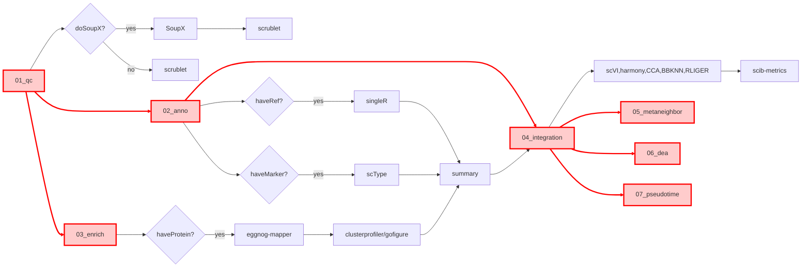

[Markdown+plantuml:最强流程图绘制](https://mp.weixin.qq.com/s/YbXcBRphGjPEaDgEvfXblA)
```plantuml
:10x matrix;
if (01_qc) then (doSoupX)
  :SoupX;
  note left
    rawPaths
    filterPaths
    sampleValues
  end note
  :scrublet;
else (not doSoupX)
  :scrublet;
  note right
    test
  end note
endif


if (02_anno) then (auto)
  if (haveRef?) then (yes)
    :singleR;
  (no) elseif (haveMarker?) then (yes)
    :scType;
  else (no)
    stop
  endif
  :summary;
  note left
    weight.txt
  end note
else (manual)
  if (03_enrich) then (haveGo)
    :clusterprofiler;
  else (no)
    stop
  endif

endif

:Run Integration;

stop
```

